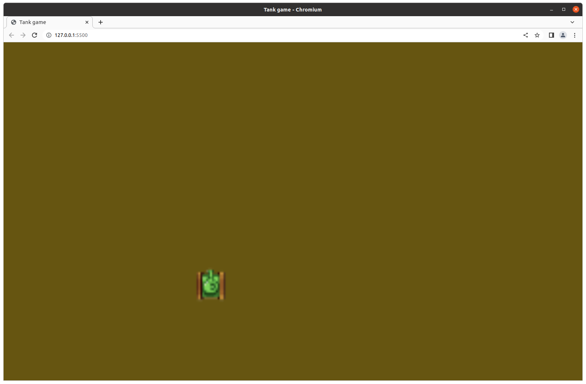
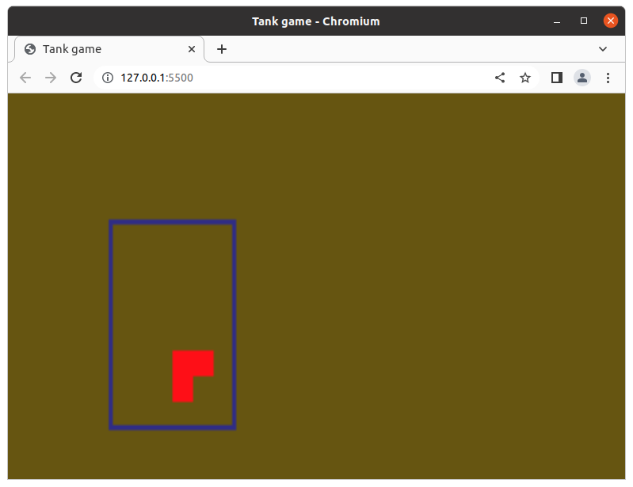
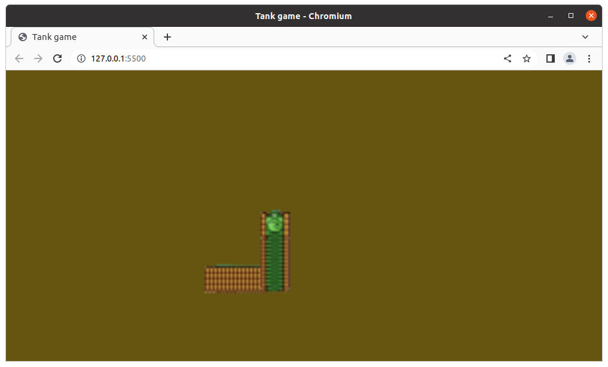

# Lesson 1

In this lesson, we create a simple Javascript game, where we can move a Tank with WASD keys.
We also publish it to github.io. At this point, our code will not be structured very well; we should come back to that later.

The game should look somewhat like on the image below.



Most of this lesson will be about setting up the development and deployment environment. Basic knowledge of git is welcome.

We will be using git for version control and deployment, and Visual Studio Code (VSCode) for development.

## Setting up development environment

Whichever operating system you are using, you should install Visual Studio Code. Once it is installed, you should use the following plugin: [Live server plugin](https://marketplace.visualstudio.com/items?itemName=ritwickdey.LiveServer). You should also have Chrome as your main browser (this plugin worked well with Chromium for me, while it had problems with Mozilla Firefox). This plugin will let you open your index.html file in the browser, where it will autoupdate if you save one of your files (at least this is the functionality we use).

If you have the plugin installed, then you should see a Go Live button at the bottom right corner of your VSCode window.

## Creating project
Create a folder in an arbitrary place on your computer. Open the folder with VSCode: File -> Open Folder. Once you have it open, create a new file called index.html. Insert the following text inside it:

```html
<!DOCTYPE html>
<html lang="en">

<head>
    <meta charset="UTF-8">
    <title>Tank game</title>
    <link rel="stylesheet" href="index.css">
</head>

<body>
    <canvas id="c"></canvas>
</body>

</html>
```

Then also create an index.css file with the following content:

```css
html,
body {
    height: 100%;
    margin: 0;
}

#c {
    width: 100%;
    height: 100%;
    display: block;
    background: #665500;
}
```

Now push the Go Live button on the right bottom corner of your VSCode window. The index.html file should open in a browser tab and you should see a blank page with brownish color.

What we did:
- We created a html page with a canvas: `<canvas id="c"> </canvas>`.
- We linked a stylesheet: index.css.
- In the stylesheet, we made the canvas span the whole page, and set its background to our brownish color.

Next, we are going to draw on it.

## Draw on canvas
There are multiple drawing functions available for an HTML5 Canvas. You can draw rectangles, circles and pictures. In this project, we will primarily be drawing pictures. However, let's first look at a simple Rectangle drawing example!

### Draw rectangles
In order to draw on the canvas, we will use Javascript code. Javascript is a whole new world for someone, who has not yet programmed in it. I will explain a few things about the Javascript codes written, but I won't go into detail about the language itself. If I explain something you understood at first glance, then feel free to skip ahead. If you feel entirely lost in Javascript, then spend some time in a tutorial ([this](https://www.tutorialspoint.com/javascript/javascript_quick_guide.htm) for example), and you won't regret it.

Simply put, you can use Javascript, a lightweight scripting language, to write programs, which will be executed in browsers, in the context of your web page. You can use it for server-side programming too, but we will only be focusing on the browser side of things for now.

So, let's create a `js` directory, where we will be putting any JS files we later create. For now, let's create `index.js` in the `js/` directory. To run the contents of `index.js` for the `index.html` page, change the `index.html` content like this:

```html
<body>
    <canvas id="c"></canvas>
    <script src="js/index.js"></script> <!--PUT THIS LINE HERE!-->
</body>
```

Now we can edit `index.js`! Let's insert the following code!

```javascript
const canvas = document.getElementById("c");
const ctx = canvas.getContext("2d");

ctx.strokeStyle = 'blue'
ctx.strokeRect(50, 50, 60, 80);

ctx.fillStyle = 'red'
ctx.fillRect(80, 100, 20, 20);

ctx.clearRect(90, 110, 10, 10);
```

After you inserted the code openned the new `index.html`, you should see something like the picture below.



Let us explain what is happening, line by line:
- `const canvas = document.getElementById("c");` This line uses the `document` element, which represents your web page (this element is available for you in your browser Javascript code). The `canvas` is an element in your web page, and you can access it by id, hence `getElementById`. The query returns the canvas object, which we store in the `canvas` constant.
- `const ctx = canvas.getContext("2d");` The canvas object has a context, which will be using for drawing. We query the 2 dimensional context, and store it in a constant.
- Drawing on the context can happen by "stroking", "filling" or "clearing". Stroking creates the perimeter of the drawn object (rectangle), filling fills the shape, while clearing sets the shape to the default color. We can set the color of the drawing, then draw. When drawing a rectangle, we supply the rectangle's top left coordinates (x, y) and its size (width, height).

### Draw a picture
In our game, we will mostly be drawing pictures. You can download the tank picture I am using [here](https://github.com/bbalage/JSCanvasGameCourse/blob/lesson1/img/tank.png) (or fetch one of your own). Download the image, then place it as `img/tank.png`, where `img` is a directory in the project root.

The following code should draw the image, if pasted to `index.js` (you can remove all previous code from the file; that was just for show-off). However, the code probably won't work.

```javascript
const canvas = document.getElementById("c");
const ctx = canvas.getContext("2d");

const tankSprite = new Image();
tankSprite.src = "img/tank.png"

ctx.drawImage(
    tankSprite,
    100, // x
    100, // y
    15,  // width
    15   // height
);
```

This code creates a new image, then sets its source (a file, where the image data is located), and finally draws the image. If we want to ensure that this code works, we need to write the drawing section like this:

```javascript
tankSprite.addEventListener("load", function () {
    ctx.drawImage(
        tankSprite,
        100,
        100,
        15,
        15
    );
});
```

If you are familiar with Javascript, this should cause no surprise for you. If not, read this paragraph! When you set `tankSprite`'s source (src), the image started to load. However, `ctx.drawImage` executed before all data could have been loaded from the file. Consequently, nothing was drawn. The solution is to add an event listener to tankSprite, which basically executes a function, when the image is loaded.

So an image was loaded. Now, we should move it. Only the Russian winter can stop this tank!

### Moving an object
Moving the tank takes more lines of code and more fuel. Thankfully, we have lines. Let's write them! You can leave the following lines in the `index.js`:


```javascript
const canvas = document.getElementById("c");
const ctx = canvas.getContext("2d");

const tankSprite = new Image();
tankSprite.src = "img/tank.png";
```

You should add the following lines afterwards:

```javascript
class Tank {
    constructor() {
        this.x = 100;
        this.y = 100;
        this.speed = 2;
    }
}

const tank = new Tank();
```

Depending on how familiar you are with Javascript, this paragraph might not be necessary for you. We have just created a class to store values... Yes, this class is just for data storage for now, no methods, no encapsulation. Not very object oriented. We will get to that on the next lessons. However, now you know that Javascript, like Java, also has classes.

This class only contains a constructor, where we set three numeric attributes for the tank: its position and its speed. Then, we create a constant reference to a new tank object. Remember, the reference is constant, but the object is not. This means that we can change the attributes of the object through the constant reference, but we cannot make the reference point to another object. Consequently, const is fine.

Now, let's write a handle for user input:

```javascript
function keydownHandler(e) {
    switch (e.code) {
        case "KeyW":
            tank.y -= tank.speed;
            break;
        case "KeyA":
            tank.x -= tank.speed;
            break;
        case "KeyS":
            tank.y += tank.speed;
            break;
        case "KeyD":
            tank.x += tank.speed;
            break;
    }
}

document.addEventListener("keydown", keydownHandler, false);
```

Here, `keydownhandler` is a function, which receives an `e` argument, which stands for *event* (common notation). `e` is a descriptor, which contains information about "what has just happened". Since this function will be listening for keypress events, we will use `e` to retrieve which key was pressed. `e.code` gives us the keycode, where keycodes are in the format `KeyA`, `KeyB`, etc. Here, we are going to handle WASD, nothing else. If WASD was pressed, we update the tank's position.

Another Javascript thing you can notice here, is that `keydownHandler` sees `tank`. Not what you saw in C and Java. If you want to know more, read about *Javascript closures*. If not, just accept it. We will try to minimize such external dependencies of functions.

Adding keydownHandler happens through the `document` object (which represents the web page). The first argument tells the interpreter, which kind of events we want to listen for, keydownHandler is the function to call if the event occurs, and the last boolean argument is a bit longer to write down, but not important enough to distract ourselves with.

Now the position of tank is updated in reaction for WASD keypresses. Next, we have to change how the drawing is executed to make any effect.

Paste the following:

```javascript
function gameLoop() {
    ctx.drawImage(
        tankSprite,
        tank.x,
        tank.y,
        15,
        15
    );
    requestAnimationFrame(() => gameLoop());
}

gameLoop();
```

This might take a few reads to sink in. First, let's make it clear what we want: we want to draw the tank again and again. We have to, because if we don't draw it again and again, then we won't see its position change. So, we could write an infinite loop:

```javascript
// Very bad
function gameLoop() {
    while (true) {
        ctx.drawImage(
            tankSprite,
            tank.x,
            tank.y,
            15,
            15
        );
    }
}

gameLoop();
```

However, if you try this, you notice that the execution gets stuck. The script never finishes, the webpage never launches. You cannot write an infinite loop like this in Javascript, because the script is run, when you load the page and just keeps running.

What you *can* do, is you can call `requestAnimationFrame`. By doing so, you request the browser to create an animation by calling a function multiple times over and over. It depends on browser refresh rate how many times the function gets called. 60 is a reasonable number (this has to do with FPS: Frames Per Seconds, where 30 FPS is considered real time, and above that you can do slow monition playbacks). If you want the animation function get called over and over again forever, then you need to call `requestAnimationFrame` from within the function, and supply the function itself.

So, `gameLoop()` is the function we want to call at least 30 times per second, and we should keep calling it forever (until we close the page at least). It is, in a way, our infinite loop. In the function, there is a drawing call. Then, finally, we have the last scary line:

`requestAnimationFrame(() => gameLoop());`

Remember, we need to supply `requestAnimationFrame` a function as its argument. In Javascript, `() => console.log("Hi");` is a lambda function, which is a short for `function () {console.log("Hi");}`. It is a nameless function, created just now. The nameless function calls `gameLoop()` and that's it. Why not write `requestAnimationFrame(gameLoop);`? You can write that too, it still works the same. The reason I wrote a lambda function is that (1) it, if you've seen lambda functions before, makes the intent even clearer than simply writing a function name, and, more importantly, (2) in Javascript, the meaning of `this` is not the same in the two cases if gameLoop is a class method.

If you feel like you can take more of Javascript, then read the next code snippet. It doesn't work. `this` is undefined in the context. However, it works fine with `requestAnimationFrame(() => this.gameLoop())`. Javascript things.
```javascript
class Game {
    constructor() {
        this.frame = 0;
    }

    gameLoop() {
        ctx.clearRect(0, 0, canvas.width, canvas.height);
        ctx.drawImage(
            tankSprite,
            tank.x,
            tank.y,
            15,
            15
        );
        this.frame++;
        console.log(this.frame);
        requestAnimationFrame(this.gameLoop);
    }
}

const game = new Game();
game.gameLoop();
```

All that said, the `index.js` file should look like this:

```javascript
const canvas = document.getElementById("c");
const ctx = canvas.getContext("2d");

const tankSprite = new Image();
tankSprite.src = "img/tank.png";

class Tank {
    constructor() {
        this.x = 100;
        this.y = 100;
        this.speed = 2;
    }
}

const tank = new Tank();

function keydownHandler(e) {
    switch (e.code) {
        case "KeyW":
            tank.y -= tank.speed;
            break;
        case "KeyA":
            tank.x -= tank.speed;
            break;
        case "KeyS":
            tank.y += tank.speed;
            break;
        case "KeyD":
            tank.x += tank.speed;
            break;
    }
}

document.addEventListener("keydown", keydownHandler, false);

function gameLoop() {
    ctx.drawImage(
        tankSprite,
        tank.x,
        tank.y,
        15,
        15
    );
    requestAnimationFrame(() => gameLoop());
}

gameLoop();
```

Watch what happens!



I intentionally left something out. The only gets draw, but never gets deleted from its previous position. So:

### **Task:**
Make the previous tank disappear (you can use external sources, but you can find the solution on this very page too)!

## Publish the project
We have written what we set out to write: the tank moves by WASD. It doesn't turn properly, but we will get to that later. Now, it is time to make this project available on Github!

You are probably already be able to create a Github repository and push an existing project to it. If not, refer to [external sources](https://www.datacamp.com/tutorial/git-push-pull).

First, create **public** a Github repository, and push everything in the project directory to it!
When you are done, your directory structure should look somewhat like this:

```
project
|
|—–img
|  |––tank.png
|––js
|  |——index.js
|——index.css
|——index.html
```

To make this game playable anyone on the web, we will use [Github Pages](https://docs.github.com/en/pages/quickstart). Github Pages are public webpages shared through Github repositories. Its primary use is for documentation. However, since the hosted pages are HTML5 pages, they have everything we need to make our canvas game available.

**Note:** Publishing a game like this is not the road to commercial success. We publish it here, because it's free and easy to do so, the game would be widely available, and you can play your game from any computer with internet connection. Simply put, it's easy and fun, and you will see early results.

To publish your repository, click Settings > Pages. You need to set a branch to be tracked by Github Pages (*master* branch is probably the best choice) and a directory. For the directory, choose *root*. Save your settings.

After a few seconds (or a minute :sob: :sob), Github Pages should be built. You can access your game on https://username.github.io/RepoName which will direct you to the index.html file you published in the root of the repo.

## Extra tasks:
Now, add a functionality of your own! A little research might be needed. If you know instantly how to do these small tasks, please, skip to the next lesson. If not sure, do your research, and complete them!

### **Task 1:** (easy)
Make two tanks, instead of one! Control the other tank with arrows!

### **Task 2:** (medium)
Make the tank turn! Only 90° turns are allowed. If you start heading in another direction, the tank image should be updated instantly (no turning animation is needed). You can do this task two simple ways: rotating through `ctx` (do your google research) or creating a different tank.png for each of the four directions. Both are good!

### **Task 3:** (a little hard)
Make the tank(s) shoot! No collision detection is needed, no hitboxes are necessary. Just draw circles or some kind of rocket image, and let them fly! Don't forget to destroy them if they go out of the screen!