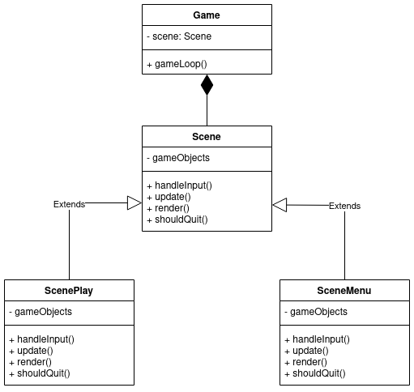

# Lesson 2
In this lesson, we are going to do a big refactoring! We could put all of our content in just one file,
but it would soon become a pain to scroll that single file all the time.

Before we go on, let's ask the question: What will our game do when it's ready as planned? What
functionalities does a game usually have? What functionalities we want for our game? Where do we start?
Well, let's see:
- **Tanks**: It's a tank game.
- **Rotation**: Our tank wants to turn. We need that.
- **Hit box / bounding box**: We are going to need that, if we want any of the following:
  - The tank stopping at an obstacle.
  - The tank shooting and damaging anyone/anything else with the bullet.
- **Static objects**: obstacles, covers. Just to make the playground more interesting.
- **Shooting and damaging**: These two come hand in hand I'm afraid.
- **Camera:** What if our playground doesn't fit on the screen? Then we need a camera that follows the tank.
- **Main menu**: This is just sugar on the cake, but let's go for it!
- **Enemies**: This could get arbitrarily hard, but our game isn't much without them. 

What do you think, how many lines do you need for that? I think, we can agree, that you would keep most of your precious development hours scrolling. So, let's refactor!

## Structuring

Since we are starting to think bigger, we need to build our blocks in a way they can support a more advanced game. Javascript is not as focused on object oriented programming as Java, but it supports OO principles. We are going to use this support.

First, let's just think about what we said about our goals! Our game will have:
- a menu,
- the game itself.

It is also common to have a pause menu, but we don't go there (you can add it yourself). 

If you look up any game programming learning material, you will probably come across the concept of the
game loop. The game loop runs as long as the game does, so from our perspective, forever (because we can
trust the browser to clean up after us). The loop does three things:
- handles input,
- updates the game objects,
- renders the game objects.
These three things have to be done in the menu and the game too (here, we decided to render everything
on the canvas, and don't use HTML buttons and such for menu purposes).

So, to represent these requirements, I created two classes: Game and Scene. There is only one game, whose
job is to switch between scenes. A Game stores a reference to the active scene, and calls the methods
of the scene, where the methods are: `handleInput`, `update`, `render`. Effectively, the Scene implements
the actions of the game loop. The game switches scenes if necessary. The following UML diagram represents
this idea.



There is one additional method to the Scene: `shouldQuit`. This is a way to notify the Game about a need
to switch scenes. Of course, we somehow have to know which is the next scene to load, but as long as
there are only two scenes, we are fine like this.

Let's write some dummy code! You can comment or delete all code from the previous lesson, because we
are, effectively going to wipe it off the board.

First, create a `scene.js` file in the `js` folder, and paste the following content:

```javascript
class Scene {

    constructor() { }

    handleInputCtx() { console.log("Warning: defaulting scene function..."); }
    update() { console.log("Warning: defaulting scene function..."); }
    render() { console.log("Warning: defaulting scene function..."); }
    shouldQuit() { console.log("Warning: defaulting scene function..."); }
}

class ScenePlay extends Scene {

    constructor() { super(); }

    handleInputCtx() { console.log("Handling input."); }
    update() { console.log("Updating."); }
    render() { console.log("Rendering.") }
    shouldQuit() { return false; }
}
```

For now, we are avoiding the implementation of a menu, because we have more important things to do.
In Javascript, the inheritence is kind of not necessary, because there is no static checking as to what
methods an object has. However, at least we state our intent quite clearly: ScenePlay is a Scene, and 
Game will rely on the Scene interface. The methods are only dummies for now.

Let's create a file, named `game.js` in the `js` folder. Paste the following content:

```javascript
class Game {

    constructor() {
        this.scene = new ScenePlay();
    }

    gameLoop() {
        this.scene.handleInputCtx();
        this.scene.update();
        this.scene.render();
        if (this.scene.shouldQuit()) {
            console.log("Here we should handle switching scenes.");
        }
        requestAnimationFrame(() => this.gameLoop());
    }
}
```

As you can see, there is no logic for switching scenes, but there will be later. That's Game's job.

Now, the `index.js` file only needs the following two lines:

```javascript
const game = new Game();
game.gameLoop();
```

And we need to import new files in the `index.html`:

```html
<body>
    <canvas id="c"></canvas>
    <script src="js/scene.js"></script> <!--We are new here...-->
    <script src="js/game.js"></script> <!--Notice the order of imports.-->
    <script src="js/index.js"></script>
</body>
```

Now, we have our skeleton. Let's add the meat!

## Tank
First, let's create a tank that rotates. We will put the code of the tank into a `tank.js` file. Create and import the file:

```html
<body>
    <canvas id="c"></canvas>
    <script src="js/tank.js"></script> <!--Hello there...-->
    <script src="js/scene.js"></script>
    <script src="js/game.js"></script>
    <script src="js/index.js"></script>
</body>
```

We create the Tank class. We aim for generality (so we don't have to change the Tank class, when we add enemy tanks), so we insert all necessary data in the constructor. I will skip ahead to the part, where I already know what this data is exactly. The class with the constructor looks like the following:

```javascript
class Tank {
    constructor(x, y, w, h, rotation, speed, rotationSpeed, spriteName) {
        this.x = x;
        this.y = y;
        this.w = w;
        this.h = h;
        this.rotation = rotation;
        this.speed = speed;
        this.rotationSpeed = rotationSpeed;
        this.spriteName = spriteName;
    }

    // Rest of the class goes here
}
```

Obviously, this just sets everything up. Functions come later. Some of the constructor arguments are fairly straight-forward:
- x, y: the initial position of the tank.
- w, h: width and height of the tank.
- rotation: rotation in degrees.
- speed: how much does one step change the tank's position.
- rotationSpeed: how many degrees does one turn movement rotate the tank.
- spriteName: least obvious... we don't store the image with the tank, because multiple tanks could have the same image; this is why we store only the name of the image, and put the image elsewhere in an associative table, accessible by name.

There are two other things the tank needs to be able to do (currently): move and rotate. Both get a function inside the class. Paste the following:

```javascript
move(direction) {
    const dir = direction <= 0 ? -1 : 1;
    this.x += Math.sin(this.rotation * Math.PI / 180) * this.speed * dir;
    this.y -= Math.cos(this.rotation * Math.PI / 180) * this.speed * dir;
}

rotate(direction) {
    this.rotation += direction >= 0 ? this.rotationSpeed : -this.rotationSpeed;
    if (this.rotation >= 360) {
        this.rotation -= 360;
    }
    else if (this.rotation < 0) {
        this.rotation += 360;
    }
}
```

This is the least obvious from the bunch. Let's look at the code for `rotate`! This is fairly simple. The `direction` argument sets the direction of the rotation: if direction is 0 or greater, the tank rotates clockwise, otherwise anti-clockwise. If the tank "overrotates", we reset the rotation by a 360 degrees "turn" in the appropriate direction (so the value of the angle stays between 0 and 360).

The movement is harder, but we have a formula for that. The role of `direction` is obvious: does the tank go forward or backward. Let's look at the lines with the *sine* and *cosine* functions! What you can see inside the brackets is simply a conversion from degrees to radians. `Math.sin(/*Switch to radians*/)`. With sine, you get the `x` coordinate of the unit vector starting from origo and rotated by `rotation` degrees. Unclear? Put another way: getting the sine of the angle gives you the 1 length step in `x` direction (as cosine does in `y` direction). If we want to use speed, we multiply by it. If we want to use direction, we can change the speed to negative for going backwards.

If you want to understand why sine and cosine, you should try drawing what you have. However, it is a known formula, so don't overstress about it.

## Scene
We have the Tank, you let's use it in Scene! In ScenePlay (which is one type of Scene), we will store, move, draw the tank. However, first let's give some tools for this job to ScenePlay! Change the constructor of ScenePlay to look like the following:

```javascript
class ScenePlay extends Scene {

    constructor(canvas, ctx, sprites) {
        super();
        this.canvas = canvas;
        this.ctx = ctx;
        this.sprites = sprites;

        // Lots of magic numbers here! Need for a configuration file?
        this.player = new Tank(10, 10, 15, 15, 0, 1, 3, "tank");
    }
}
```

We simply asked for a context, and created the tank with almost arbitrary values. Notice, that we received `sprites` from outside. Later, we will create a separate class for rendering, but for now, we are good.

There are three functions, that we want to change: `handleInputCtx`, `update`, `render`. Let's go one by one:

```javascript
handleInputCtx(inputCtx) {
    if (inputCtx.KeyW) {
        this.player.move(1);
    } else if (inputCtx.KeyS) {
        this.player.move(-1);
    }
    if (inputCtx.KeyA) {
        this.player.rotate(-1);
    } else if (inputCtx.KeyD) {
        this.player.rotate(1);
    }
}
```

In `handleInputCtx` the `inputCtx` argument needs a bit of explanation. When we look at our structure,
we can ask the question: where should the user interaction logic go? We want to know whether a given
key is pushed down or not. How we retrieve this information doesn't interest us in any implementation
of Scene. So we change our interface a little, and we take an object called `inputCtx`. This object
holds data about the state of the keyboard: `inputCtx.someKey` is true if `someKey` is currently pressed.

The rest is nothing special: we are just calling the methods of the tank. `update` is even more obvious,
since we literally don't do anything yet (remove the *console.log* part!).

```javascript
update() { }
```

`render` is where we do the ugly stuff:

```javascript
render() {
    this.ctx.clearRect(0, 0, this.canvas.width, this.canvas.height);
    const tankCenter = {
        x: this.player.x + this.player.w / 2,
        y: this.player.y + this.player.h / 2
    }
    this.ctx.save();
    this.ctx.translate(tankCenter.x, tankCenter.y);
    this.ctx.rotate(this.player.rotation * Math.PI / 180);
    this.ctx.translate(-tankCenter.x, -tankCenter.y);
    this.ctx.drawImage(
        this.sprites[this.player.spriteName],
        this.player.x,
        this.player.y,
        this.player.w,
        this.player.h
    );
    this.ctx.restore();
}
```

Most of this comes down to computer geometry reasons; rotation is not as obvious from a technical viewpoint
as it might seem. Let's go through this line by line! I will suggest some changes for you to make along 
the line, but please, return to this place once we have written `Game`.
- `clearRect` should not sound new. We simply delete everything from the canvas before we start drawing.
- `tankCenter` is also obvious. We calculate the center of the tank, because we are going to rotate it
around its center. I suggest you to set this to something else, anything that's not the Tank's center.
You might find the results interesting (though the player won't be happy about it).
- `ctx.save()` is handy, because when we rotate an object, we actually rotate the world around it.
It's like if the painter moved the canvas and not the brush when he/she wanted to paint from a different
angle. Since you are going to change the context of the html canvas, you first save it, so you can return
to it later.
- `ctx.translate(tankCenter.x, tankCenter.y)` moves the context so the center of the Tank becomes the 
center of the world (0, 0). Again, if you don't do this, you can check out what happens (simply remove the 
two lines where we translate the context). The Tank still gets rotated, but not around its center. It 
will be like if it were orbiting the sun, but the sun is origo of the coordinate system.
- `ctx.rotate` does the rotation. We have to supply the Tank's rotation in radians.
- `ctx.translate(-tankCenter.x, -tankCenter.y)` translates the coordinate system back to its original 
position before drawing. If we haven't done this, the Tank would always be drawn in the center of the 
coordinate system.
- `ctx.drawImage` has one change that might strike you strange: `this.sprites[this.player.spriteName]`.Remember the constructor! We supplied all images to ScenePlay, so we just have to access them by name.
This is exactly what happens here.
- `ctx.restore()` is the pair of `save`: we change the context back to the way it was when we last saved.
Check out what happens if we don't do this (remove or comment this line)! Rotation should go crazyyy!

That's almost it, folks! Let's see the last piece: Game.

## Game
Here, I'm going to just hit you with it; paste this to `game.js`:

```javascript
class Game {

    constructor() {
        const canvas = document.getElementById("c");
        const ctx = canvas.getContext("2d");

        const sprites = {
            "tank": new Image()
        }
        sprites["tank"].src = "img/tank.png";

        this.scene = new ScenePlay(canvas, ctx, sprites);
        this.inputCtx = {
            KeyW: false,
            KeyS: false,
            KeyA: false,
            KeyD: false,
        };
        document.addEventListener("keydown", (e) => this.keyDownHandler(e), false);
        document.addEventListener("keyup", (e) => this.keyUpHandler(e), false);
    }

    gameLoop() {
        this.scene.handleInputCtx(this.inputCtx);
        this.scene.update();
        this.scene.render();
        if (this.scene.shouldQuit()) {
            console.log("Here we should handle switching scenes.");
        }
        requestAnimationFrame(() => this.gameLoop());
    }

    keyDownHandler(e) {
        this.inputCtx[e.code] = true;
    }

    keyUpHandler(e) {
        this.inputCtx[e.code] = false;
    }
}
```

The constructor initializes everything, while gameLoop does what we planned at the beginning: calls
the appropriate Scene with the required context. The previously discussed `inputCtx` is a member of 
Game. The event listeners are also member functions, and all they do is set the state of `inputCtx`
appropriately. We also create the Image objects in the constructor.

## Tasks

These tasks are not optional; in the next lesson, I will assume they are done. You can look up their
solution in the source files (the git branch `lesson2` will point to the right state of the code).
I suggest you try to do them yourself, then adjust your code to the one I wrote (you might get into
less trouble later if you don't diverge too much).

### **Task 1:** (medium)

Measure FPS, and print it to the screen! It will be a useful number to look as we add more and more 
computation intensive tasks.

### **Task 2:** (easy)

Change the Tank (and `ScenePlay`), so the rotation will be stored in radian. The constructor of Tank
should still take it in degrees.