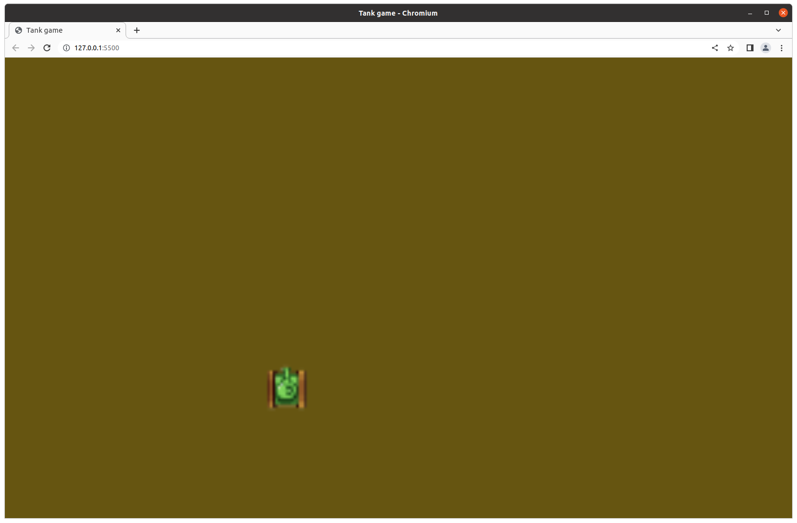

# Lesson 1

In this lesson we create a simple Javascript game, where we can move a Tank with WASD keys.
We also publish it to github.io. At this point, our code would not be structured very well,
but we will fix that later.

The game should look somewhat like on the image below.



Most of this lesson will be about setting up the development and deployment environment. Basic knowledge of git is welcome.

We will be using git for version control and deployment, and Visual Studio Code (VSCode) for development.

## Setting up development environment

Whichever operating system you are using, you should install Visual Studio Code. Once it is installed, you should use the following plugin: [Live server plugin](https://marketplace.visualstudio.com/items?itemName=ritwickdey.LiveServer). You should also have Chrome as your main browser (this plugin worked well with Chromium for me, while it had problems with Mozilla Firefox). This plugin will basically let you open your index.html file in the browser, where it will autoupdate if you save one of your files.

If you have the plugin installed, then you should see a Go Live button at the bottom right corner of your VSCode window.

## Creating project
Create a folder in an arbitrary place on your computer. Open the folder with VSCode: File -> Open Folder. Once you have it open, create a new file called index.html. Insert the following text inside it:

```
<!DOCTYPE html>
<html lang="en">

<head>
    <meta charset="UTF-8">
    <title>Tank game</title>
    <link rel="stylesheet" href="index.css">
</head>

<body>
    <canvas id="c"></canvas>
</body>

</html>
```

Then also create an index.css file with the following content:

```
html,
body {
    height: 100%;
    margin: 0;
}

#c {
    width: 100%;
    height: 100%;
    display: block;
    background: #665500;
}
```

Now push the Go Live button on the right bottom corner of your VSCode window. The index.html file should open in a browser tab and you should see a blank page with brownish color.

What we did:
- We created a html page with a canvas `<canvas id="c"> </canvas>`.
- We linked a stylesheet index.css.
- In the stylesheet, we made the canvas span the whole page, and set its background to our brownish color.

Next, we are going to draw on it.